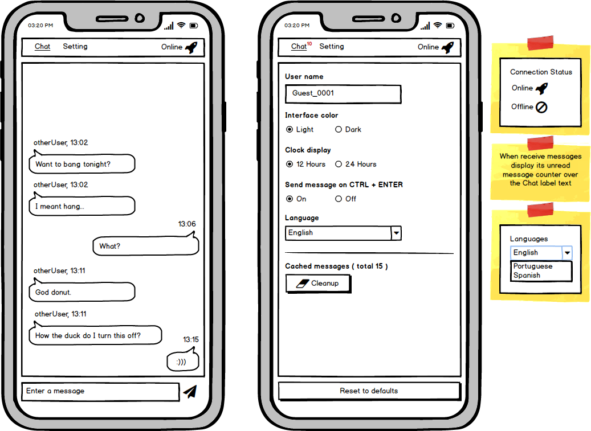
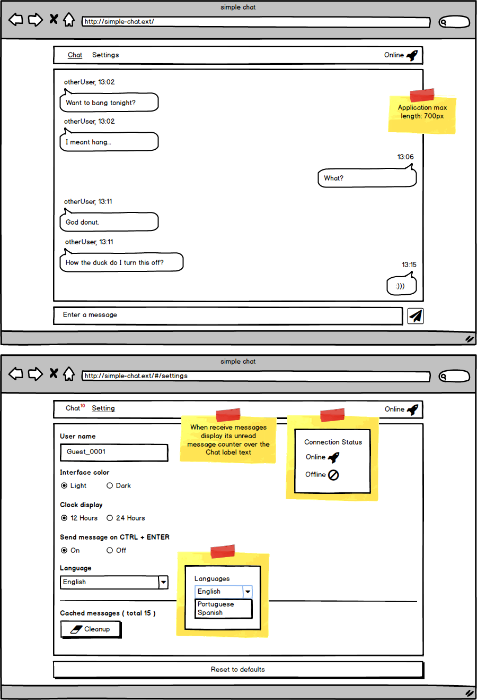

# Project features by versions

- [1.0.0](#100)
- [next](#next)

## 1.0.0

* Simple chat application which uses a socket.io server to handle and deliver its messages

  * This project has it own socker.io server implementation, which is used on the local development environment and has a deployed version of it, learn more about it on the [server/README.md](../../server/README.md)

* Mobile first with responsible layout that adjusts on the mobile/table devices to the portrait or landspace orientation

* It has light or dark color themes

* It has internationalization with the available languages: English, Portuguese and Spanish

  * The application detects which is the users language and apply it as the default settings

* It has a shortcut keyboard to submit the messages, where on the mobile/table devices is `ENTER` and on the desktop is `CTRL + ENTER`

  * By default it is active, but the user can disable it on the settings page

* The application uses the localstorage to persist its data

  * Messages

  * Selected settings

  * On the settings page has options to cleanup the cached messages or reset to default settings

* It has a socket.io server connection status, online or offline, displayed on the navigation bar at right

* It has an unread counter displayed over the chat tab when the user is on the settings page

* Mobile UI mockups

* Desktop UI mockups

## next

* Improve the documentation

* Review/improve services
