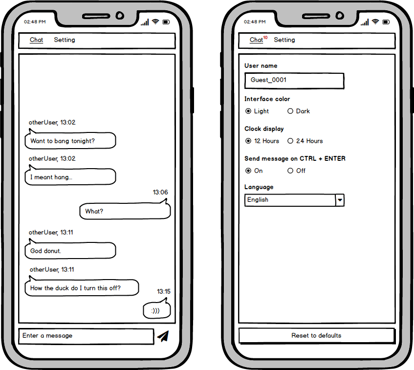
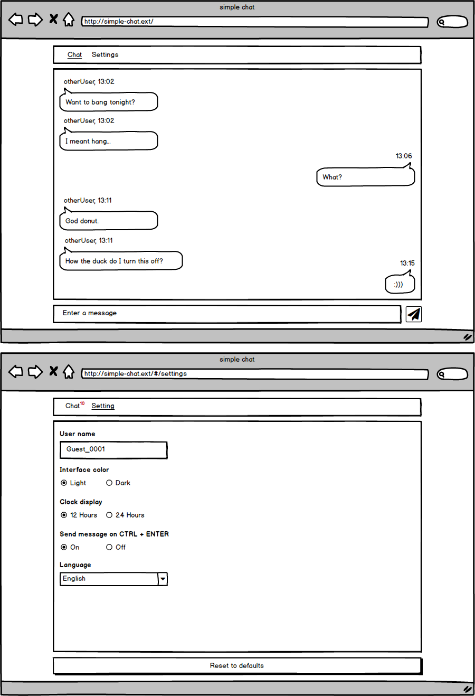

# Features requirements by versions

- [1.0.0](#100)
  - [UI mockups](#ui-mockups)
- [next](#next)

## 1.0.0

* The application should have a navigation bar and two pages

  * Chat page

    * Should display the messages

      * Messages from the application user should be displayed at right, only with the time

      * Messages from the other users should be displayed on the left, with the sender user name and received time

      * The time displayed should follow the configuration on the settings page

    * Should cache the received messages

    * Should have a input field to send messages, that respects the configuration on the settings page

  * Settings page

    * Should have a field to update the user name

    * Should have radio buttons to switch between light or dark colors theme

    * Should have radio buttons to select the clock display

    * Should have radio buttons to enable the keyboard shortcut to send the message

    * Should have a language select options to change the labels of the application to the selected one 

    * Should have a button to cleanup the cached messages

    * Should cache the selected settings

    * Should have a button to reset to the defaults settings

  * Navigation bar

    * Should have a link/tab to the chat page and other to the settings page

    * When the user selected the settings page, the application should display the number of the unread messages over the chat link/tab and then, when the user returns to the chat page that number should disappear

### UI mockups

* Mobile

* Desktop

## next

* Chat page

  * Message text parser to support

    * Smiles

    * Links

      * Video - should embedded and display it

      * Image - should display it

      * others - display as anchor

* Settings page

  * Add a dropdown to defines the length of the cached messages [1000, 500, 300, 100]

  
